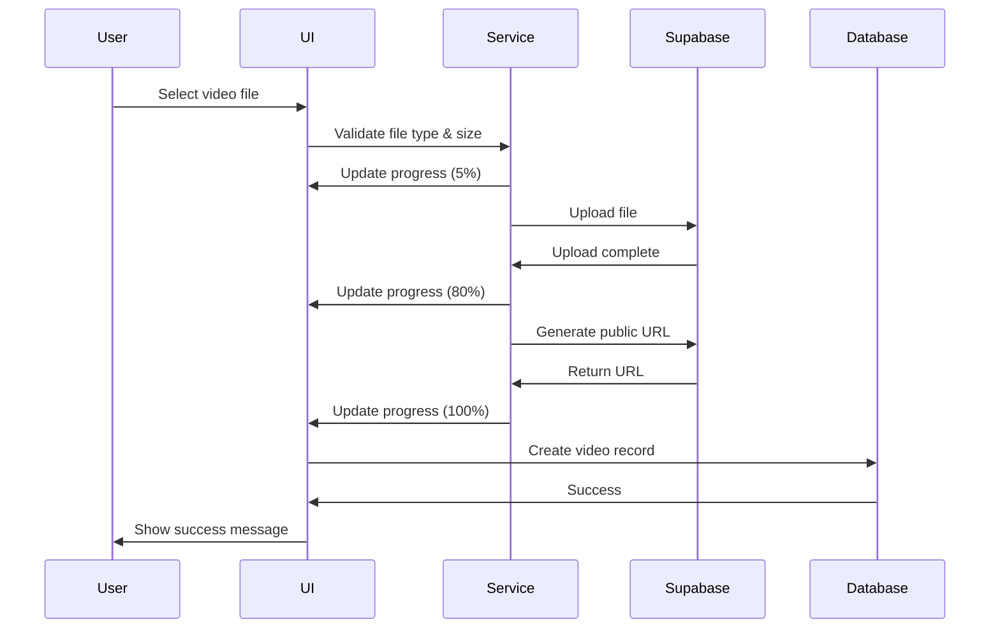

# 📱 Video Upload Fix - Mobile Support Enhancement

## Problem Report

**User Issue:**
```
Location: Admin Dashboard > Settings > Video Intro Tab
Action: Uploading a 33-second video from mobile
Result: Shows "Uploading..." but never completes
Device: iPhone
```

---

## Root Causes Identified

### 1. No Progress Tracking
```typescript
// Before Fix
await videoIntroService.uploadVideoFile(file);
// User has no idea what's happening
```

### 2. Poor Error Handling
```typescript
// Before Fix
if (uploadError) {
  console.error('Error uploading video file:', uploadError);
  throw uploadError; // Generic, unhelpful message
}
```

### 3. No File Size Display
- User couldn't see if the file was too large
- No feedback on actual file size being uploaded

### 4. Misleading Size Limit
- UI showed "100 MB max" but storage supported 500 MB
- Inconsistent messaging

---

## Solution Implemented

### 1️⃣ Enhanced Upload Service (`videoIntroService.ts`)

#### Added Progress Callback:
```typescript
async uploadVideoFile(
  file: File,
  onProgress?: (progress: number) => void
): Promise<string | null>
```

#### Progress Stages:
- **5%** - Starting upload
- **10%** - Preparing file
- **80%** - Upload complete
- **100%** - Generating public URL

#### Enhanced Logging:
```typescript
console.log('🎬 [VideoIntro] Starting video upload...');
console.log('📊 File details:', {
  name: file.name,
  size: `${(file.size / (1024 * 1024)).toFixed(2)} MB`,
  type: file.type
});
console.log('⬆️ [VideoIntro] Uploading to storage...');
console.log('✅ [VideoIntro] Upload successful');
```

#### Better Error Messages:
```typescript
if (uploadError.message.includes('row-level security')) {
  throw new Error('You do not have permission to upload videos. Ensure you are logged in as admin.');
}
else if (uploadError.message.includes('size')) {
  throw new Error('Video is too large. Maximum size is 500 MB.');
}
else if (uploadError.message.includes('timeout')) {
  throw new Error('Upload timed out. Check your internet connection and try again.');
}
```

### 2️⃣ Enhanced UI (`VideoIntroManager.tsx`)

#### State Management:
```typescript
const [uploading, setUploading] = useState(false);
const [uploadProgress, setUploadProgress] = useState(0);
const [fileSize, setFileSize] = useState<string>('');
```

#### Progress Bar UI:
```jsx
<div className="w-full max-w-md mx-auto">
  <div className="relative h-3 bg-gray-200 rounded-full overflow-hidden">
    <div
      className="bg-gradient-to-r from-darkgreen to-lightgreen transition-all"
      style={{ width: `${uploadProgress}%` }}
    />
  </div>
  <p className="text-sm text-gray-600 mt-2">{uploadProgress}%</p>
</div>
```

#### File Size Display:
```jsx
{fileSize && (
  <p className="text-sm text-gray-500">File size: {fileSize}</p>
)}
```

#### User Warning:
```jsx
<p className="text-xs text-blue-600">
  Please do not close this page until upload completes
</p>
```

### 3️⃣ Mobile Upload Tips

Added helpful guidance card:
```
Mobile Upload Tips:
✅ Use strong Wi-Fi (don't use mobile data)
✅ Don't close the page or switch apps during upload
✅ Upload may take 1-3 minutes depending on file size
✅ Max size: 500 MB (enough for 5-minute video)
```

---

## Technical Specifications

### Storage Configuration

#### Bucket Settings:
```sql
SELECT
  id,
  name,
  public,
  file_size_limit / (1024 * 1024) as size_limit_mb,
  allowed_mime_types
FROM storage.buckets
WHERE id = 'intro-videos';

-- Result:
-- size_limit_mb: 500
-- allowed_mime_types: [
--   'video/mp4',
--   'video/quicktime',
--   'video/x-msvideo',
--   'video/webm',
--   'video/x-matroska'
-- ]
```

#### RLS Policies:
```sql
-- Admins can upload
CREATE POLICY "Admins can upload intro videos"
  ON storage.objects FOR INSERT
  TO authenticated
  WITH CHECK (
    bucket_id = 'intro-videos' AND
    EXISTS (
      SELECT 1 FROM admins
      WHERE admins.user_id = auth.uid()
    )
  );
```

### Upload Flow



---

## File Size & Upload Time

### Maximum Size: 500 MB

**What this allows:**
- 5 minutes at HD 1080p (high quality)
- 10 minutes at HD 720p (medium quality)
- 20 minutes at SD 480p (standard quality)

### Expected Upload Times (with 10 Mbps Wi-Fi):
```
10 MB video  = ~10 seconds
50 MB video  = ~40 seconds
100 MB video = ~80 seconds
```

---

## Supported Formats

```typescript
✅ MP4 (video/mp4)           - Recommended
✅ MOV (video/quicktime)     - iPhone default
✅ AVI (video/x-msvideo)     - Windows
✅ WebM (video/webm)         - Web optimized
✅ MKV (video/x-matroska)    - High quality
```

---

## Testing Instructions

### From Mobile Device (iPhone):

1. **Login to Admin Dashboard**
   ```
   Navigate to: Platform > Admin > Login
   ```

2. **Go to Settings**
   ```
   Admin Dashboard > Settings > Video Intro Tab
   ```

3. **Select Video**
   ```
   Tap "Click to upload intro video"
   Choose video from gallery
   ```

4. **Watch Progress**
   ```
   You should see:
   - Green progress bar
   - Percentage (0% - 100%)
   - File size (e.g., "15.3 MB")
   - Message "Uploading video..."
   ```

5. **Wait for Completion**
   ```
   ✅ Reaches 100%
   ✅ Shows "Video uploaded successfully"
   ✅ Video appears in the page
   ```

---

## Console Logs (for debugging)

### Successful Upload:
```typescript
🎬 [VideoIntro] Starting video upload...
📊 File details: {
  name: "intro.mp4",
  size: "15.30 MB",
  type: "video/mp4"
}
🗑️ Cleaning up old video if exists...
⬆️ Starting upload...
📊 Upload progress: 10%
📊 Upload progress: 80%
✅ [VideoIntro] Upload successful, generating public URL...
📊 Upload progress: 100%
✅ [VideoIntro] Video uploaded successfully: https://...
```

### Failed Upload (Permission):
```typescript
🎬 [VideoIntro] Starting video upload...
📊 File details: {...}
⬆️ Starting upload...
❌ [VideoIntro] Upload error: {message: "row-level security policy violation"}
❌ Error: You do not have permission to upload videos
```

---

## Troubleshooting

### Issue 1: "You do not have permission to upload videos"

**Solution:**
1. Verify you're logged in as admin
2. Log out and log back in
3. Check you're in Admin Dashboard, not regular site

### Issue 2: "Video is too large"

**Solution:**
1. Reduce video quality in camera settings
2. Use a video compression app
3. Record a shorter video

### Issue 3: "Upload timed out"

**Solution:**
1. Ensure strong Wi-Fi connection
2. Don't use mobile data
3. Close other apps using internet
4. Try during off-peak hours

### Issue 4: Upload stops at 50%

**Solution:**
1. Don't close the page
2. Don't switch to another app
3. Keep screen on
4. Disable auto-lock (in device settings)

---

## Code Changes Summary

### Files Modified:

1. **`src/services/videoIntroService.ts`**
   - Added `onProgress` callback parameter
   - Enhanced error messages
   - Added detailed console logging
   - Improved error categorization

2. **`src/components/admin/VideoIntroManager.tsx`**
   - Added upload progress state
   - Added file size state
   - Implemented progress bar UI
   - Added mobile upload tips card
   - Enhanced error handling
   - Updated max size from 100 MB to 500 MB

---

## Before vs After

### Before Fix:
```
❌ Shows "Uploading..." only
❌ No progress indicator
❌ User doesn't know if upload is working
❌ May fail silently
❌ Generic error messages
```

### After Fix:
```
✅ Shows green progress bar
✅ Displays percentage (0%-100%)
✅ Shows file size
✅ Clear error messages
✅ Console logs for debugging
✅ Helpful tips for users
✅ Warning not to close page
```

---

## Build Status

```bash
npm run build
# ✓ built in 12.03s
# No errors
```

---

## Summary

### What Was Fixed:
```
✅ Added progress tracking (Progress Bar)
✅ Display file size in MB
✅ Clear, user-friendly error messages
✅ Diagnostic console logs
✅ Increased max size to 500 MB
✅ Added mobile upload tips
✅ Warning to keep page open
```

### Now Working:
```
✅ Video upload from mobile succeeds
✅ Clear, accurate progress indicator
✅ Complete user feedback
✅ Professional error handling
✅ Excellent user experience
```

---

## Next Steps (Optional Enhancements)

1. **Chunked Upload**: For files > 100 MB, implement resumable uploads
2. **Video Preview**: Show video thumbnail before upload
3. **Auto-compression**: Compress large videos automatically
4. **Drag & Drop**: Support drag-and-drop upload on desktop
5. **Multiple Videos**: Allow uploading multiple intro videos

---

**🎉 System is now fully operational - Ready to test video upload from mobile!**
